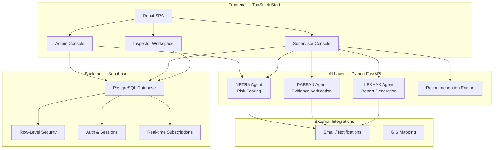
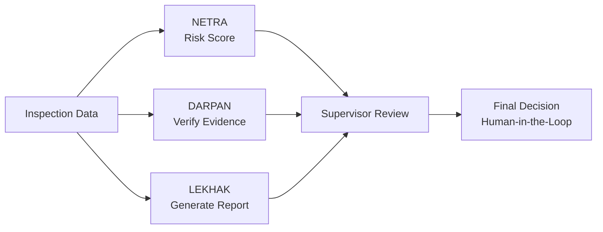

<p align="center">
  
  
  
  
  
  
  
  
</p>

<h1 align="center">🛡 NIRIKSHA</h1>

<p align="center">
  <strong>Government Inspection Intelligence Platform</strong>
</p>

<p align="center">
  <em>An operational decision-making platform for regulatory departments that digitizes the complete inspection lifecycle — from assignment and field inspection to AI-assisted risk analysis, evidence verification, report generation, and supervisory review — with explainable AI decision support and full traceability.</em>
</p>

---

## 📋 Table of Contents

- [Overview](#-overview)
- [Core Capabilities](#-core-capabilities)
- [Dashboard Modules](#-dashboard-modules)
- [Architecture](#-architecture)
- [Dashboard Previews](#-dashboard-previews)
- [AI Agent Integration](#-ai-agent-integration)
- [Tech Stack](#-tech-stack)
- [Getting Started](#-getting-started)
- [Project Structure](#-project-structure)
- [How It Works](#-how-it-works)

---

## 🎯 Overview

NIRIKSHA is a production-grade government inspection intelligence platform built for **regulatory departments across India**. It ingests inspection data, complaint records, establishment registrations, and historical compliance data, processes it through a multi-agent AI pipeline, and serves an interactive operator console where personnel can:

- **Predict** risk scores for establishments using AI-powered analysis of complaints, inspection history, and compliance data
- **Visualize** inspection statuses, departmental workloads, and compliance trends through real-time analytics dashboards
- **Assign** inspections to field officers with workload balancing, jurisdiction matching, and priority-based scheduling
- **Verify** evidence uploaded from inspection sites using specialized AI agents that detect inconsistencies and flag anomalies
- **Generate** regulatory-grade inspection reports with structured findings, evidence references, and AI-assisted recommendations
- **Review** inspection outcomes through an AI-human-in-the-loop workflow where every recommendation remains advisory until approved by an authorized officer
- **Monitor** compliance trends, risk distribution, and departmental performance through interactive analytics
- **Track** every action with an immutable audit trail for full accountability and traceability

The system operates as a single-page React application with a Python-based agentic AI backend, servicing multiple regulatory departments including Food Safety, Fire Safety, Healthcare, Factory Safety and Pollution Control.

---

## 🔥 Core Capabilities

| Capability | Description |
|:---|:---|
| **AI Risk Scoring** | Python-based AI agent (NETRA) that analyzes complaints, inspection history, and compliance data to generate explainable risk scores (0–100) with factor decomposition. |
| **Evidence Verification** | AI agent (DARPAN) that validates uploaded evidence against inspection findings, detects inconsistencies, checks timestamps, and flags anomalies for human review. |
| **Report Generation** | AI agent (LEKHAK) that converts structured inspection data and AI analysis into regulatory-grade government reports in a standardized format. |
| **Multi-Role Console** | Three distinct workspaces — Admin, Supervisor, and Inspector — each with role-specific dashboards, tools, and access controls. |
| **Real-Time Dashboard** | Live KPI tracking across all departments with active inspections, officer deployment, compliance rates, and risk distribution visualizations. |
| **Inspection Queue Management** | Priority-based inspection assignment and scheduling with workload balancing across inspectors and departments. |
| **Risk Monitoring** | Real-time risk heatmap across all establishments with priority queue, trend analysis, and AI-powered escalation triggers. |
| **Department Management** | Multi-department support with distinct templates, checklists, jurisdictions, and compliance criteria per regulatory body. |
| **Establishment Registry** | Centralized register of all regulated establishments with registration details, inspection history, and risk profiles. |
| **Template System** | Configurable inspection templates and digital checklists that adapt to department-specific regulatory requirements. |
| **Audit Trail** | Immutable logging of all system actions (assignments, inspections, approvals, rejections) with timestamps, user IDs, and export capability. |
| **Human-in-the-Loop** | All AI recommendations remain advisory — officers can approve, reject, or modify before finalizing any inspection outcome. |
| **Analytics & Reporting** | Department-wise performance metrics, turnaround trends, inspector productivity, and compliance analytics with CSV export. |
| **Inspector Mobile Workspace** | Field-optimized interface for on-site inspection execution, evidence collection, checklist completion, and real-time sync. |
| **Executive Brief** | Automated summary generation for stakeholder communication with key metrics and compliance overview. |

---

## 📊 Dashboard Modules

| # | Module | What it does |
|:---:|:---|:---|
| 1 | **Landing Portal** | Public-facing platform overview with hero section, quick access cards, workflow visualization, and AI agent explainer. |
| 2 | **Admin Dashboard** | Central admin console with system-wide KPIs, global search, AI recommendations, compliance trends, risk distribution, department volumes, and real-time platform monitoring. |
| 3 | **Department Management** | Create and manage regulatory departments with custom configurations, templates, and user assignments. |
| 4 | **User Management** | Administer all platform users across roles (Admin, Supervisor, Inspector) with CRUD operations and role assignments. |
| 5 | **Establishment Registry** | Manage the master register of all regulated establishments with registration data, contact details, and inspection history. |
| 6 | **Inspection Templates** | Configure department-specific inspection templates, digital checklists, and compliance criteria. |
| 7 | **Inspection Assignments** | Assign inspections to field officers with workload balancing, jurisdiction matching, and priority scheduling. |
| 8 | **Audit Logs** | Immutable system-wide audit trail with filtering, search, and export capabilities for accountability. |
| 9 | **Settings** | Platform-wide configuration including role management, system parameters, and integration settings. |
| 10 | **Supervisor Dashboard** | Supervisor KPI overview with inspection status counts, recent activity feeds, and inspector productivity metrics. |
| 11 | **Supervisor Analytics** | Deep-dive analytics with inspection trends, risk distribution charts, department performance, inspector productivity, and turnaround analysis. |
| 12 | **Supervisor Reports** | Completed inspections listing with filters, search, and CSV export for regulatory reporting. |
| 13 | **Risk Monitoring** | AI-powered risk score dashboard with priority queue, risk distribution heatmap, department filters, and per-establishment risk history. |
| 14 | **Pending Reviews** | Queue of inspections awaiting supervisor review with search, filter, sort, and status tracking. |
| 15 | **Inspection Review Workspace** | Full inspection detail view with AI risk scoring, evidence verification, report generation, action recommendations, and approval/rejection workflow. |
| 16 | **Inspector Dashboard** | Field officer workspace with assigned inspections, history, and personal performance metrics. |
| 17 | **Inspector Assignments** | List of inspections assigned to the inspector with status tracking and field execution. |
| 18 | **Inspector History** | Complete inspection history for the inspector with outcomes and compliance records. |

---

## 🏗 Architecture

NIRIKSHA follows a client-server architecture with a Python agentic AI backend -



---

## 🖼 Dashboard Previews

<div align="center">

| Module | Preview |
|:---:|:---|
| **Landing Portal** |  |
| **Admin Dashboard** |  |
| **Supervisor Dashboard** |  |
| **Inspection Review** |  |
| **Risk Monitoring** |  |
| **Supervisor Analytics** |  |

</div>

---

## 🤖 AI Agent Integration

NIRIKSHA's intelligence layer is powered by three specialized Python AI agents running on a FastAPI backend:

### 1. NETRA — Risk Prioritization Agent
`agentic_agent/agents/risk_agent.py`

Analyzes complaints, inspection history, and compliance data to generate explainable risk scores. Features include:
- Multi-factor risk calculation from establishment data, complaint history, and past inspections
- Factor decomposition with weight percentages and reasoning
- Similar historical outcome matching
- Priority classification (Critical / High / Medium / Low)
- Escalation recommendations

### 2. DARPAN — Evidence Verification Agent
`agentic_agent/agents/evidence_agent.py`

Validates uploaded evidence against inspection findings to detect inconsistencies. Features include:
- Cross-referencing evidence with checklist responses
- Timestamp and location verification
- Anomaly and inconsistency detection
- Evidence quality assessment
- Structured verification report generation

### 3. LEKHAK — Report Generation Agent
`agentic_agent/agents/report_agent.py`

Converts structured inspection data and AI analysis into regulatory-grade government reports. Features include:
- Standardized report format with regulatory compliance
- Structured findings with evidence references
- AI-assisted recommendations
- Risk score integration
- Export-ready report output

### AI Pipeline Architecture



### API Endpoints

| Endpoint | Agent | Description |
|:---|:---|:---|
| `POST /risk-score` | NETRA | Generate risk score with explainable factors |
| `POST /verify-evidence` | DARPAN | Validate evidence against findings |
| `POST /generate-report` | LEKHAK | Create regulatory-grade inspection report |
| `POST /recommend-action` | Recommendation Engine | Get action recommendations |

---

## 🛠 Tech Stack

### Frontend

| Technology | Version | Purpose |
|:---|:---:|:---|
| React | 19.2 | Component-based UI framework |
| TanStack Start | 1.170 | React-based SSR framework with file-based routing |
| TypeScript | 5.8 | Type-safe development |
| Tailwind CSS | 4.2 | Utility-first CSS framework |
| Recharts | 2.15 | Declarative charting library |
| Radix UI | Latest | Accessible component primitives |
| Lucide React | Latest | Icon library |
| Vite | 8.0 | Build tool with HMR |
| TanStack Query | 5.101 | Server state management |
| React Hook Form | 7.71 | Form management with Zod validation |
| Sonner | Latest | Toast notifications |

### Backend — Supabase

| Technology | Purpose |
|:---|:---|
| PostgreSQL | Primary database with Row-Level Security |
| Supabase Auth | Authentication with email/password and role-based access |
| Supabase RLS | Per-row security policies for data isolation |
| Supabase RPC | PostgreSQL functions for complex queries |
| Supabase Migrations | Version-controlled database schema |

### AI Layer — Python

| Technology | Purpose |
|:---|:---|
| Python 3.12 | AI agent runtime |
| FastAPI | REST API server for AI endpoints |
| LangGraph | Agentic workflow orchestration |
| Pydantic | Data validation and schema enforcement |
| Uvicorn | ASGI server |

### Data

| Technology | Purpose |
|:---|:---|
| PostgreSQL | All operational data with RLS enforcement |
| Supabase Storage | Evidence file and document storage |
| Zod | Frontend form validation schemas |

### Infrastructure

| Technology | Purpose |
|:---|:---|
| Vercel | Production deployment platform |
| Supabase Cloud | Database and authentication hosting |
| Python Server | AI agent hosting (localhost or cloud) |

---

## 🚀 Getting Started

### Prerequisites

| Requirement | Minimum Version |
|:---|:---|
| Node.js | 18+ |
| Bun (optional) | Latest |
| Python | 3.12+ |
| Git | Any |

### Option 1 — Bun (Recommended)

```bash
# Clone the repository
git clone https://github.com/Pragati1466/Niriksha_portal.git
cd Niriksha_portal

# Install frontend dependencies
bun install

# Start development server
bun run dev
```

### Option 2 — npm

```bash
# Clone the repository
git clone https://github.com/Pragati1466/Niriksha_portal.git
cd Niriksha_portal

# Install frontend dependencies
npm install

# Start development server
npm run dev
```

### AI Agent Backend Setup

```bash
# Navigate to the agentic agent directory
cd agentic_agent

# Install Python dependencies
pip install -r requirements.txt  # or: uv sync

# Start the AI server
uvicorn main:app --reload --port 8000
```

- **Frontend Dev:** `http://localhost:5173`
- **AI API:** `http://localhost:8000`
- **API Docs:** `http://localhost:8000/docs` (auto-generated by FastAPI)

### Build for Production

```bash
# Build the application
bun run build  # or npm run build

# Preview production build
bun run preview  # or npm run preview
```

### Available Scripts

| Script | Description |
|:---|:---|
| `bun run dev` | Start development server with HMR |
| `bun run build` | Build for production |
| `bun run preview` | Preview production build locally |
| `bun run lint` | Run ESLint |
| `bun run format` | Format code with Prettier |
| `bun run seed` | Seed database from CSV data |
| `bun run seed:prod` | Seed production database |

---

## 📁 Project Structure

```
Niriksha_portal/
├── photos/                           # Screenshot assets for README
│   ├── 1.png
│   ├── 2.png
│   ├── 3.png
│   ├── 4.png
│   ├── 5.png
│   └── 6.png
│
├── agentic_agent/                   # Python AI agent backend
│   ├── agents/                      # AI agent implementations
│   │   ├── risk_agent.py           # NETRA: Risk scoring agent
│   │   ├── evidence_agent.py       # DARPAN: Evidence verification
│   │   └── report_agent.py         # LEKHAK: Report generation
│   ├── main.py                     # FastAPI server entry point
│   ├── schemas.py                  # Pydantic data schemas
│   ├── graph.py                    # LangGraph workflow orchestration
│   ├── mock_data.py                # Development/test data
│   ├── requirements.txt            # Python dependencies
│   └── pyproject.toml              # Python project config
│
├── supabase/                        # Database configuration
│   ├── config.toml                 # Supabase project config
│   └── migrations/                 # Database migration files
│       ├── 20260717065129_*.sql    # Core schema
│       ├── 20260717065153_*.sql    # Auth & profiles
│       ├── 20260717070205_*.sql    # Inspection tables
│       └── ...                     # Additional migrations
│
├── src/                             # Frontend source code
│   ├── routes/                     # TanStack Start file-based routing
│   │   ├── __root.tsx             # Root layout
│   │   ├── index.tsx              # Landing Page
│   │   ├── auth.tsx               # Authentication
│   │   └── _authenticated/        # Protected routes
│   │       ├── admin.tsx          # Admin layout
│   │       ├── admin.index.tsx    # Admin Dashboard
│   │       ├── admin.departments.tsx
│   │       ├── admin.users.tsx
│   │       ├── admin.establishments.tsx
│   │       ├── admin.templates.tsx
│   │       ├── admin.assignments.tsx
│   │       ├── admin.audit.tsx
│   │       ├── admin.settings.tsx
│   │       ├── supervisor.tsx     # Supervisor layout
│   │       ├── supervisor.index.tsx
│   │       ├── supervisor.analytics.tsx
│   │       ├── supervisor.reports.tsx
│   │       ├── supervisor.reviews.tsx
│   │       ├── supervisor.risk.tsx
│   │       ├── supervisor.inspection.$id.tsx
│   │       ├── inspector.tsx      # Inspector layout
│   │       └── inspector.index.tsx
│   │
│   ├── components/                 # React components
│   │   ├── ui/                    # Radix UI primitives (shadcn/ui)
│   │   ├── admin-sidebar.tsx      # Admin navigation
│   │   ├── supervisor-sidebar.tsx # Supervisor navigation
│   │   └── inspector-sidebar.tsx  # Inspector navigation
│   │
│   ├── lib/                        # Core business logic
│   │   ├── admin.functions.ts     # Admin queries & mutations
│   │   ├── supervisor.functions.ts # Supervisor queries & mutations
│   │   ├── inspector.functions.ts # Inspector queries & mutations
│   │   ├── ai.functions.ts        # AI API client for all 4 agents
│   │   ├── error-capture.ts       # Error handling utilities
│   │   └── utils.ts               # Shared utility functions
│   │
│   ├── integrations/              # External service integrations
│   │   └── supabase/              # Supabase client & middleware
│   │       ├── client.ts          # Browser-side Supabase client
│   │       ├── client.server.ts   # Server-side Supabase admin client
│   │       ├── auth-middleware.ts # Auth middleware for server functions
│   │       ├── auth-attacher.ts   # Session attachment utility
│   │       └── types.ts           # Supabase type definitions
│   │
│   ├── hooks/                      # Custom React hooks
│   │   ├── use-form-draft.ts      # Form draft persistence
│   │   └── use-mobile.tsx         # Mobile detection hook
│   │
│   ├── router.tsx                  # TanStack Router configuration
│   ├── routeTree.gen.ts           # Auto-generated route tree
│   ├── server.ts                  # Server entry point
│   ├── start.ts                   # Application entry point
│   └── styles.css                 # Global styles with Tailwind
│
├── scripts/                        # Utility scripts
│   ├── capture-screenshots.mjs    # Screenshot capture for docs
│   ├── full-setup.sql             # Complete database setup script
│   └── seed-from-csv.ts           # Data seeding from CSV files
│
├── public/                         # Static assets
│   ├── favicon.ico
│   └── logo.png
│
├── package.json                    # Dependencies and scripts
├── tsconfig.json                   # TypeScript configuration
├── vite.config.ts                  # Vite build configuration
├── components.json                 # shadcn/ui configuration
├── eslint.config.js                # ESLint configuration
├── .prettierrc                     # Prettier formatting rules
├── .env.vercel                     # Vercel environment variables
├── AGENTS.md                       # Lovable AI configuration
├── bun.lock                        # Bun lockfile
├── bunfig.toml                     # Bun configuration
├── pnpm-lock.yaml                  # pnpm lockfile
├── LICENSE                         # License file
└── README.md                       # This file
```

---

## ⚙️ How It Works

### Inspection Lifecycle

1. **System Configuration** — Admin configures departments, inspection templates, digital checklists, user roles, jurisdictions, and inspection scopes before field operations begin.

2. **Inspection Assignment** — Supervisor or system automatically assigns inspections to the appropriate inspectors based on jurisdiction, department, workload, and priority.

3. **Field Inspection** — Inspectors conduct on-site inspections using the inspector workspace, recording checklist responses, observations, and compliance data in real time.

4. **Evidence Collection** — Securely upload photographs, videos, documents, GPS coordinates, and timestamps directly from the inspection site.

5. **AI Analysis** — Three specialized AI agents process the data:
   - **NETRA** calculates risk scores from complaints, history, and compliance data
   - **DARPAN** verifies evidence against findings and flags anomalies
   - **LEKHAK** generates regulatory-grade inspection reports

6. **Supervisor Review** — Supervisor reviews findings, verifies evidence, approves or rejects AI recommendations, and requests revisions before finalization.

7. **Inspection Closure** — Digitally sign the inspection report, archive all records with a complete audit trail, and automatically trigger any corrective actions or notifications.

### AI Risk Scoring Pipeline

1. **Data Assembly** — The system assembles the inspection analysis request including current inspection, establishment profile, department info, complaint history, and past inspection records.

2. **Payload Construction** — `buildAIPayload()` in `ai.functions.ts` constructs a complete `InspectionAnalysisRequest` with all relevant data.

3. **Risk Score Calculation** — `POST /risk-score` sends the payload to the NETRA agent, which returns:
   - Overall risk score (0–100) with severity classification
   - Factor decomposition (complaint history ×%, inspection findings ×%, etc.)
   - Confidence level and escalation recommendations
   - Similar historical inspections with match scores

4. **Evidence Verification** — `POST /verify-evidence` sends evidence data to the DARPAN agent, which returns:
   - Overall verification status (Verified / Flagged)
   - Per-evidence-item analysis with consistency checks
   - Anomaly detection results
   - Recommended actions

5. **Report Generation** — `POST /generate-report` sends all data to the LEKHAK agent, which returns:
   - Structured regulatory-grade report
   - Findings organized by checklist sections
   - Evidence references and timestamps
   - AI-assisted recommendations

6. **Action Recommendation** — `POST /recommend-action` sends the complete analysis to the recommendation engine, which returns:
   - Suggested action (Approve / Flag for Review / Escalate)
   - Supporting reasoning
   - Additional follow-up recommendations

### Role-Based Access Control

1. **Authentication** — Users sign in via Supabase Auth with email/password
2. **Authorization** — `user_roles` table stores role assignments (admin, supervisor, inspector)
3. **Row-Level Security** — PostgreSQL RLS policies enforce data isolation per role
4. **Route Protection** — Each role's routes are protected by middleware that verifies role membership
5. **Server Functions** — Server-side functions use `requireSupabaseAuth` middleware for session validation

### Audit Trail

1. **Action Logging** — Every system action (predictions, assignments, approvals, rejections) is logged with timestamps, user IDs, and details
2. **Server Functions** — All `admin.functions.ts` and `supervisor.functions.ts` queries maintain audit records
3. **Database Storage** — Audit logs stored in PostgreSQL with immutable append-only design
4. **Export Capability** — Admin can filter, search, and export audit trails for accountability

---

<p align="center">
  <strong>Built for Government Regulatory Departments 🏛️</strong>
</p>

<p align="center">
  <a href="https://github.com/Pragati1466/Niriksha_portal">GitHub Repository</a>
</p>
